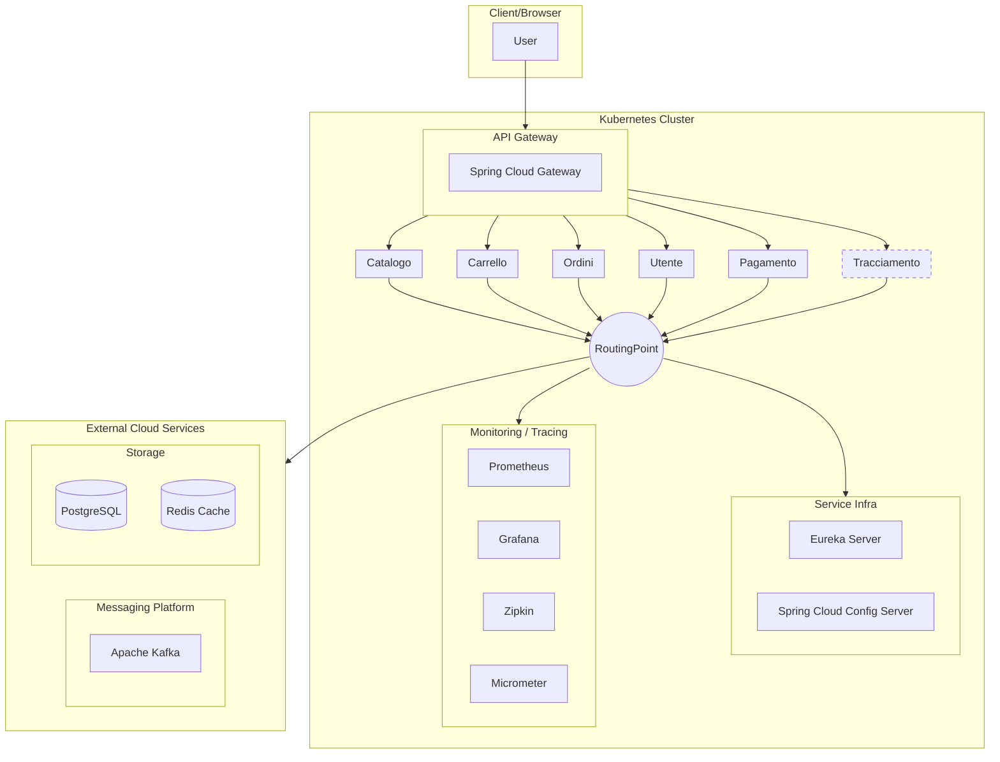
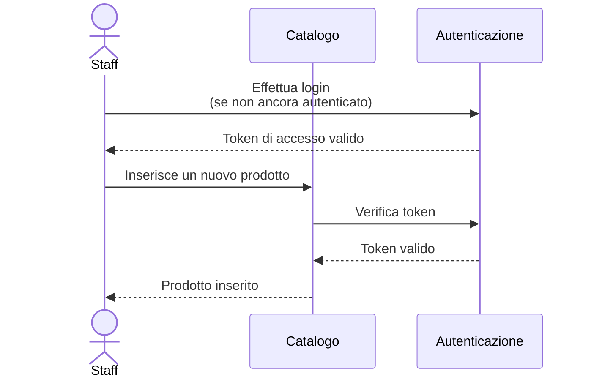
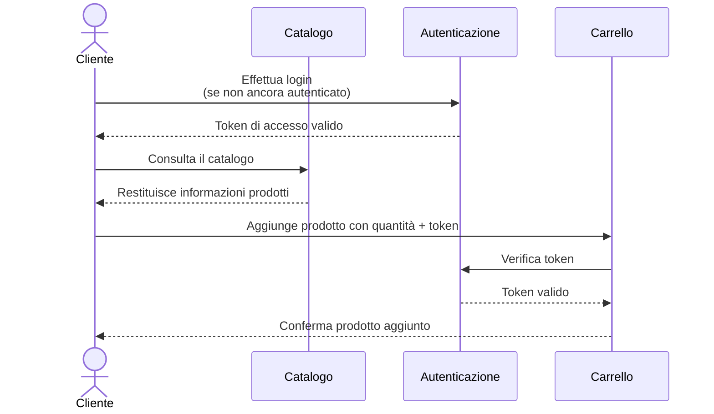
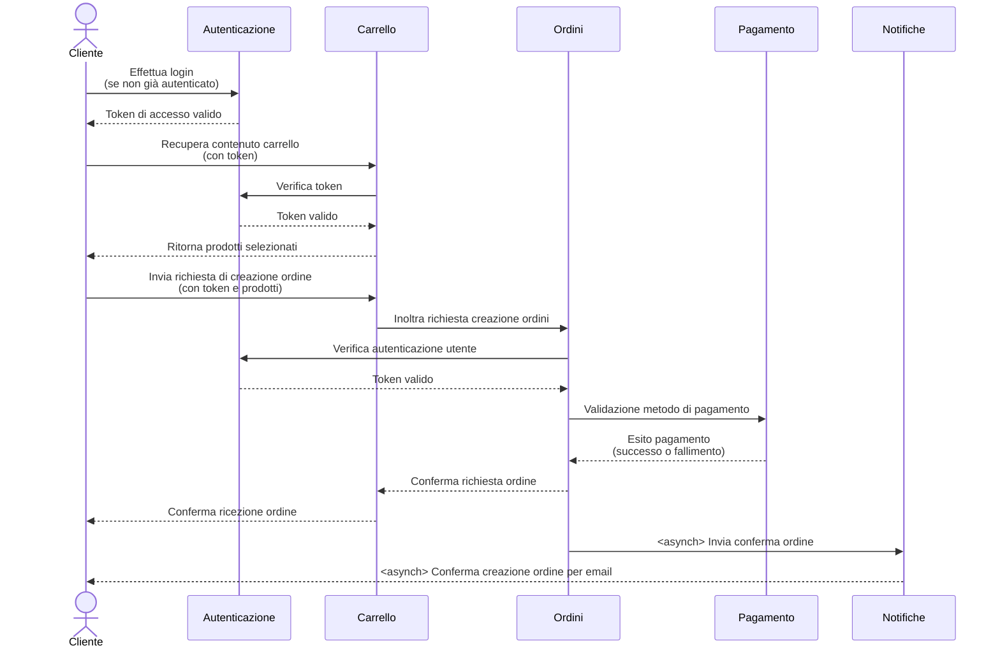

# Architettura delle soluzioni

Tutte le soluzioni basate su Mosaic sono composte dai seguenti elementi:

- API Gateway:
    - Punto di accesso per il frontend e gestione del traffico tra microservizi.
    - [Spring Cloud Gateway](https://spring.io/projects/spring-cloud-gateway)
- Service Discovery:
    - Registra e individua i microservizi attivi.
    - [Eureka Server](https://spring.io/guides/gs/service-registration-and-discovery/)
- Config Server:
    - Gestione centralizzata delle configurazioni di tutti i servizi.
    - [Spring Cloud Config](https://spring.io/projects/spring-cloud-config)
- Service-to-Service Communication: [OpenFeign](https://spring.io/projects/spring-cloud-openfeign)
- Resilienza e Circuit Breaker: [Resilience4J](https://resilience4j.readme.io/)
- Monitoring & Tracing:
    - Monitoraggio delle chiamate tra microservizi (es. Zipkin, Jaeger).
    - [Zipkin](https://zipkin.io/) + [Micrometer](https://micrometer.io/)
- Logging & Monitoring Service – Raccolta e analisi log (es. con ELK Stack o Grafana).
- Caching Service
    - Memorizzazione di dati frequenti in **Redis** per ridurre il carico.
- Resilienza e Circuit Breaker: [Resilience4J](https://resilience4j.readme.io/)
- Event-Driven Communication: [Apache Kafka](https://kafka.apache.org/) o [RabbitMQ](https://www.rabbitmq.com/)
- Database per i
  Microservizi: [PostgreSQL](https://www.postgresql.org/), [MariaDB](https://mariadb.org/), [MySQL](https://www.mysql.com/), [H2](https://www.h2database.com/html/main.html)
- Docker & Kubernetes per Deployment: [Docker](https://www.docker.com/), [Kubernetes](https://kubernetes.io/)
- Security & Compliance Service
    - Monitoraggio sicurezza e conformità GDPR.

## **Analisi del dominio**

L'applicazione da progettare sarà realizza a microservizi. Per questo motivo dobbiamo adottare una stategia
che consenta la corretta modellazione del sistema, sapendo che dovremo suddividerlo in componenti autonome.

* **Obiettivo**: Per poterlo fare, inizieremo con l'identificare i confini logici e funzionali che possono suggerire i
  microservizi.
  Una buona strada da seguire per identificare i *Bounded Contexts* è la mappa dei contesti (DDD - Domain-Driven Design)
  con *ubiquitous language*.

### Esempio Mappa dei Contesti per un E-commerce

#### **Catalogo**

* **Responsabilità**: Gestione dei prodotti, categorie, attributi e disponibilità.
* **Termini chiave**: Prodotto, Categoria, SKU, Prezzo, Descrizione.
* **Relazioni**: Fornisce informazioni al contesto **Carrello** e **Ordini**.

#### **Carrello**

* **Responsabilità**: Gestione del carrello utente, aggiunta/rimozione di prodotti.
* **Termini chiave**: Carrello, Articolo del Carrello, Quantità, Totale Parziale.
* **Relazioni**: Interagisce con **Catalogo** per ottenere dettagli sui prodotti.

#### **Ordine**

* **Responsabilità**: Gestione della creazione, stato e storico degli ordini effettuati dagli utenti.
* **Termini chiave**: Ordine, Riepilogo ordine, Stato ordine, Metodo di pagamento, Data ordine.
* **Relazioni**: Interagisce con **Carrello**, **Catalogo**, **Pagamento**, **Utente**, **Inventario**.

#### **Utente**

* **Responsabilità**: Gestione account, login, registrazione, indirizzi e ruoli.
* **Termini chiave**: Account, Autenticazione, Indirizzo, Ruolo.
* **Relazioni**: Usato da tutti i servizi che necessitano identificazione utente.

#### **Pagamento**

* **Responsabilità**: Gestione dei pagamenti, conferma o rifiuto del pagamento, interfacciamento con provider esterni (
  PayPal, Visa, MasterCard, Google Pay, ...)
* **Termini chiave**: Transazione, Stato pagamento, Metodo di pagamento.
* **Relazioni**: Si integra con **Ordine**, pubblica eventi verso **Notifica**.

#### **Notifica**

* **Responsabilità**: Invio di email o messaggi relativi a eventi dell’e-commerce (ordine confermato, spedito, pagamento
  riuscito).
* **Termini chiave**: Messaggio, Evento, Email.
* **Relazioni**: Riceve eventi da **Ordine**, **Pagamento**, **Utente**.

#### **Inventario**

* **Responsabilità**: Tracciamento e aggiornamento della disponibilità dei prodotti.
* **Termini chiave**: Rimanenze, Disponibilità
* **Relazioni**: Consulta e aggiorna dati di **Catalogo**, riceve comandi da **Ordine**.

#### **Spedizione**

* **Responsabilità**: Gestione delle spedizioni dei prodotti ordinati e pagati.
* **Termini chiave**: Consegna, Stato consegna, Corriere.
* **Relazioni**: Riceve eventi dal contesto **Pagamento** e invia eventi al contesto **Notifica**.

---

#### Relazioni tra i Contesti

* **Catalogo → Carrello**: Il contesto Carrello utilizza i dati del Catalogo per mostrare informazioni aggiornate sui
  prodotti.
* **Ordine → Pagamento**: Il contesto Pagamento utilizza l'evento creato dal contesto Ordine per far effettuare un
  pagamento relativo all'ordine fatto.
* **Pagamento → Notifica**: Al completamento del pagamento viene inviato un evento al contesto Notifiche, affinché si
  possa certificare il pagamento effettuato all'utente.
* **Ordine → Inventario**: All’acquisto, le quantità in magazzino vengono aggiornate.
* **Utente → Carrello**: Il contesto Carrello dipende dal concetto di Utente autenticato per permettere operazioni
  persistenti. Il contesto Utente fornisce l’identità necessaria per associare un carrello a una persona specifica.
* **Utente → Ordine**: Il contesto Ordine assume che esista una rappresentazione univoca dell’utente. Gli ordini sono
  generati da un utente e sono proprietà di un’identità nel sistema.
* **Utente → Pagamento**: Il contesto Pagamento delega al contesto Utente il compito di stabilire se un’azione può
  essere effettuata (autorizzazione). Il concetto di transazione è sempre riconducibile a un utente che la esegue.
* **Utente → Notifica**: Il contesto Notifica comunica con l’utente. Il contesto Utente fornisce i riferimenti validi
  per tale comunicazione, come numero di telefono o email.
* **Utente → Inventario**: Il contesto Inventario può interagire con determinati utenti (staff) che hanno la possibilità
  di modificare le quantità dei prodotti e la loro disponibilità .
* **Pagamento → Spedizione**: Il contesto Spedizione dipende dal completamento delle azioni svolte nel contesto
  Pagamento.
* **Spedizione → Notifica**: Una volta completate le azioni del contesto Spedizione, viene inviato un evento al contesto
  Notifica.

---

#### Ubiquitous Language

Si tratta di un linguaggio condiviso che mira a chiarire il significato dei termini utilizzati nella progettazione.
Di seguito riporto un esempio del dizionario da utilizzare, che verrà arricchito durante la progettazione.

* **Prodotto**: Un articolo disponibile per l'acquisto nel Catalogo.
* **Carrello**: Una raccolta temporanea di prodotti selezionati dall'utente.
* **Ordine**: Una richiesta formale di acquisto generata dall'utente.
* **SKU**: Codice identificativo del prodotto.
* **Transazione**: Operazione di pagamento avvenuto per un ordine.
* **Inventario**: Quantità disponibile dei prodotti.
* **Utente**: Qualsiasi persona registrata nel sistema con un'identità unica.
* **Account**: Insieme delle credenziali e delle informazioni associate a un utente per l'accesso al sistema.
* **Autenticazione**: Processo di verifica dell'identità di un utente.
* **Ruolo**: Un utente, se semplice cliente non specificherà alcun ruolo, altrimenti sarà parte dello staff e dovrà
  autenticarsi con credenziali ben specifiche per poter accedere all'inventario.

---

### **Casi d’uso**

I casi d'uso vengono raccolti e descritti per identificare le funzionalità principali della nostra applicazione.

In questa fase:

* Non essere troppo dettagliato e pensa ad *azioni significative* dell’utente.
* Esempi:

    * "Consulta Catalogo"
    * “Gestisce il carrello”
    * “Ordina prodotto”
    * "Paga"
    * "Modifica catalogo"
    * "Autenticazione"
    * "Visualizza storico ordini"
    * “Aggiorna dati profilo”
    * "Traccia spedizione"

---

### **Interazione tra i servizi**

Contesti e casi d'uso hanno identificato un insieme di funzionalità di alto livello (i casi d'uso) e un elenco di
componenti principali.
In questa fase è necessario mostrare le **interazioni tra i servizi principali**, anche senza scendere in troppi
dettagli.
Lo scopo, infatti, è quello di **capire i confini tra i servizi** e identificare quelli che, per coesione, sono adeguati
per essere ospitati in un unico microservizio.

---

### **Microservizi**

Usando i confini dei Bounded Contexts, combinati con l’analisi dei flussi, è possibile identificare una **coesione
funzionale**, ovvero quella parte di **dominio ben definita** che può essere gestita integralmente da un unico
microservizio. In questo modo possiamo identificare delle **responsabilità chiare** da affidare a un unico
microservizio.

Si potrebbe essere portati a far ricadere troppe o troppe poche funzionalità sullo stesso microservizio. Il rischio è,
quindi, quello di non riuscire a creare una corretta separazione tra le responsabilità, creando piccoli monoliti
distribuiti, oppure creare servizi “anemici”, ovvero troppo piccoli.

#### 1. **Catalogo**

- **Descrizione**: Fornisce informazioni sui prodotti disponibili
- **Dipendenze**: Nessuna

#### 2. **Utente**

- **Descrizione**: Gestisce gli utenti, in base al loro ruolo, e le loro informazioni
- **Dipendenze**: Nessuna

#### 3. **Carrello**

- **Descrizione**: Fornisce funzionalità per: visualizzare i prodotti inseriti, rimuovere singoli elementi e svuotarlo
  completamente.
- **Dipendenze**: Catalogo, **Utente**

#### 4. **Ordini**

- **Descrizione**: Gestisce gli ordini e le transazioni associate
- **Dipendenze**: Catalogo, Carrello, Utente

#### 5. **Pagamento**

- **Descrizione**: Gestisce il pagamento del prodotto ordinato tramite l'utilizzo di provider esterni.
- **Dipendenze**: Ordini, Utente

#### 6. **Tracciamento**

- **Descrizione**: Fornisce informazioni sulla posizione in tempo reale del prodotto spedito.
- **Dipendenze**: Ordini, Utente

---

### **Dipendenze e contratti**

Identificati i microservizi dobbiamo procedere con una analisi dei dati che devono gestire.
Per ogni microservizio è necessario domandarsi

* Quali dati possiede e/o gestisce?
* Durante il suo normale funzionamento, pubblica o consuma eventi?
* Quando comunica con gli altri microservizi, utilizza una comunicazione sincrona (es. REST/gRPC) o asincrona (es.
  eventi/pub-sub)?

Queste informazioni ti consentiranno di capire come creare legami tra i microservizi.

#### **Catalogo**

- **Dati gestiti**: Dati relativi ai prodotti, ai prezzi e alle categorie.
- **Eventi pubblicati**: Prodotto modificato, prodotto eliminato.
- **Eventi consumati**: Modifica di una quantità di un prodotto nel carrello.
- **Comunicazione**: sincrona (Rest) con Carrello, sincrona (Rest) con Ordini.

#### **Carrello**

- **Dati gestiti**: Possiede l'identificativo dell'utente, gestisce i dati relativi ai prodotti inseriti al suo interno
  e il prezzo totale parziale.
- **Eventi pubblicati**: Aggiunta di un prodotto, Modifica di una quantità di un prodotto, conferma del carrello (quando
  viene creato un ordine basato su tutti o alcuni articoli selezionati dal carrello).
- **Eventi consumati**: Modifica di un prodotto del catalogo, Eliminazione di un prodotto del catalogo, Autenticazione
  di un utente, prodotto ordinato.
- **Comunicazione**: sincrona (Rest) con Catalogo, sincrona (Rest) con Autenticazione, asincrona con Ordini.

#### **Ordini**

- **Dati gestiti**: Possiede l'identificativo dell'utente, gestisce i dati relativi ai prodotti che l'utente decide di
  ordinare, il prezzo totale.
- **Eventi pubblicati**: Prodotto ordinato.
- **Eventi consumati**: Conferma del carrello, Autenticazione di un utente, Prodotto modificato nel catalogo, prodotto
  eliminato nel catalogo.
- **Comunicazione**: Asincrona con Carrello, sincrona (Rest) con Catalogo, sincrona (Rest) con Pagamento, asincrona con
  Tracciamento

#### **Utente**

- **Dati gestiti**: Dati relativi all'utente autenticato.
- **Eventi pubblicati**: Autenticazione di un utente.
- **Eventi consumati**: Aggiunta di un prodotto al carrello
- **Comunicazione**: sincrona (Rest) con Carrello, sincrona (Rest) con Ordini.

#### **Pagamento**

- **Dati gestiti**: Possiede l'identificativo dell'utente e dell'ordine, gestisce i dati relativi al pagamento.
- **Eventi pubblicati**: Pagamento avvenuto
- **Eventi consumati**: Prodotto ordinato
- **Comunicazione**: sincrona (Rest) con Ordini

#### **Tracciamento**

- **Dati gestiti**: Possiede l'identificativo dell'utente e dell'ordine.
- **Eventi pubblicati**: Nessuno
- **Eventi consumati**: Prodotto ordinato
- **Comunicazione**: Asincrona con Ordini.

---

### Esempio di microservizi per un ecommerce

| Microservizio    | Responsabilità principale                                                |
|------------------|--------------------------------------------------------------------------|
| **Catalogo**     | Gestione dei prodotti, categorie, descrizioni                            |
| **Carrello**     | Gestione del carrello utente                                             |
| **Ordini**       | Creazione e gestione degli ordini                                        |
| **Utente**       | Creazione e gestione dei dati dell'utente autenticato e del suo profilo  |
| **Pagamento**    | Gestisce il pagamento del prodotto ordinato                              |
| **Tracciamento** | Fornire informazioni sulla posizione in tempo reale del prodotto spedito |

---

### Logica di business

#### **Carrello**

Per usufruire dei servizi del carrello è necessario che l'utente sia autenticato

Quando viene aggiunto un prodotto al carrello:

- Controlli se il prodotto è già presente
- Se NO aggiungi il prodotto

Quando viene aggiornata la quantità di un prodotto

- Controlla che la quantità sia disponibile nell'inventario

Quando viene rimosso un elemento dal carrello

- Elimina il prodotto

Quando finisce la disponibilità di un prodotto dall'inventario

- Elimina il prodotto dal carrello
- Viene inviata all'utente una notifica informativa

Quando viene svuotato il carrello

- Elimina tutti prodotti presenti
- Resetta il prezzo totale del carrello

Quando viene ordinato un prodotto

- Elimina il prodotto in questione

Il carrello dell'utente deve mantenere i prodotti anche quando egli effettua il log out. Al carrello quindi viene
associato id dell'utente

---

---

### Sequence Diagram dell'inserimento di un prodotto nel catalogo

### Sequence Diagram dell'aggiunta di un prodotto al carrello

---

### Sequence Diagram dell'acquisto di prodotti da carrello

